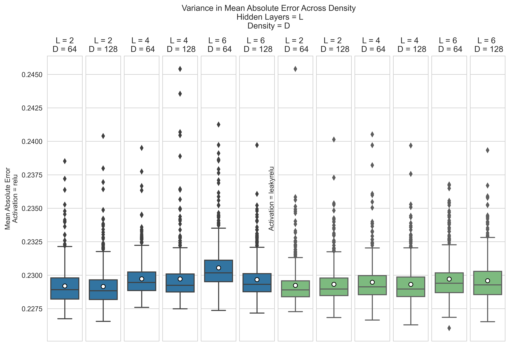

###### Anthony J. Gertz
###### Nashville Software School
###### Data Science Cohort 4
###### Final Project

# Exploration of Variance in Neural Network Training
 
 

## Data Question
How widely does Neural Network training randomize model fitting over repeated iterations and across the same data? 
 

## Learning Objectives
1.)	EDA honing with non-class sanctioned data,
2.)	ML Code & Script Automation,  
3.)    TensorFlow & Keras v2.5,  	
4.)    Multi-GPU Strategies (tf.distributed),  
4.)    Linux/Unix Environment Command Line Interface,  
5.)    Remote Coding Environments,  
6.)    Docker Container Environment  
 

## Data
F-16 Ground Vibration Benchmark Test
- Provides 20 linear and non-linear datasets of over 100,000 records each  
- F16Data_SineSW_Level3  
- https://sites.google.com/view/nonlinear-benchmark/benchmarks/f-16-gvt?authuser=0  

## Training Summary
Total Models Trained: 6000 (500 per model parameter set) 
 
Total Time Training: 336 Hours, 23 Minutes, 29 seconds 
Average Time Training: 3 minutes, 22 seconds  
 
Total Epochs: 281,838 
Average Epochs Per Model: 46.97 
 

## Model Parameters
Model: Sequential 
Regression: Linear 
Training iterations: 500 
Test Size = 0.20 
ES Test Size = 0.25 
Patience = 25 
Layers = 2/4/6 
Density = 64/128 
Activation = relu/leakyrelu 
Loss = Mean Squared Error 
Optimizer = Adam 
Batch Size = 64 
Epochs = 250 

## Variance in Epochs Across Density

## Variance in Epochs Across Activation

## Variance in MAE Across Density

## Variance in MAE Across Activation

### Primary Software Platforms: 
Ubuntu Bionic v18.04  
Python 3.9.5  
TensorFlow v2.5  
Docker CE v20.1  
NVIDIA Docker Container Toolkit 

